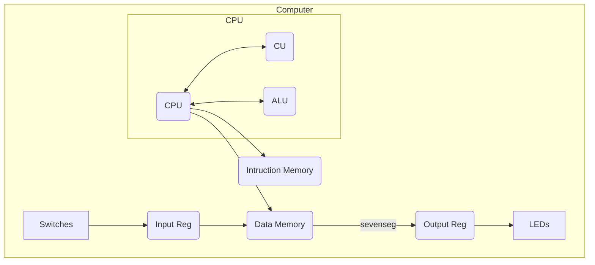

# 实验二：基本单周期 CPU 设计

## 实验目的

1. 理解计算机5大组成部分的协调工作原理，理解存储程序自动执行的原理；
2. 掌握运算器、存储器、控制器的设计和实现原理。重点掌握控制器设计原理和实现方法；
3. 掌握I/O端口的设计方法，理解I/O地址空间的设计方法；
4. 会通过设计I/O端口与外部设备进行信息交互。

## 实验内容

1. 采用Verilog HDL在Quartus Ⅱ中实现基本的具有20条MIPS指令的单周期CPU设计；
2. 利用实验提供的标准测试程序代码，完成仿真测试；
3. 采用I/O统一编址方式，即将输入输出的I/O地址空间，作为数据存取空间的一部分，实现CPU与外部设备的输入输出端口设计；
4. 利用设计的I/O端口，通过`lw`指令，输入DE1实验板上的按键等输入设备信息。即将外部设备状态，读到CPU内部寄存器；
5. 利用设计的I/O端口，通过`sw`指令，输出对DE1实验板上的LED灯等输出设备的控制信号（或数据信息）。即将对外部设备的控制数据，从 CPU 内部的寄存器，写入到外部设备的相应控制寄存（或可直接连接至外部设备的控制输入信号）；
6. 利用自己编写的程序代码，在自己设计的CPU上，实现对板载输入开关或按键的状态输入，并将判别或处理结果，利用板载LED灯或7段LED数码管显示出来：例如，将一路4-bit二进制输入与另一路4-bit二进制输入相加，利用两组分别2个LED数码管以10进制形式显示“被加数”和“加数”，另外一组LED数码管以10进制形式显示“和”等。

## 实验原理

### 应用部分

```s
main:
    addi $1, $0, 0xc0   # in_port0
    addi $2, $0, 0xc4   # in_port1
    addi $3, $0, 0x80   # out_port0
    addi $4, $0, 0x84   # out_port1
    addi $5, $0, 0x88   # out_port2
    addi $6, $0, 0x50   # memout
loop:
    lw   $7, 0($1)      # load in_port0
    lw   $8, 0($2)      # load in_port1
    add  $9, $7, $8     # in1 + in0 => out => {out0,out1,out2}
    sw   $7, 0($3)      # out_port0
    sw   $8, 0($4)      # out_port1
    sw   $9, 0($5)      # out_port2
    j    loop

```

### CPU部分



## 实验结果

可以实现预期的功能。
